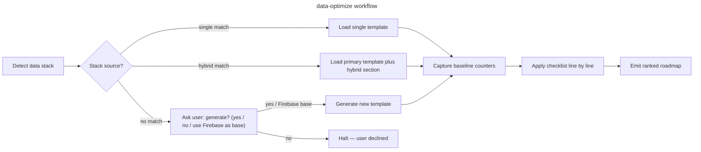

# data-optimize

## Goal

Run a structured data-layer audit on a project — covering both the calls emitted by the client (count, batching, cache, listeners) and the server logic that handles them (queries, indexes, quota, security rules) — picking the right checklist for the detected stack, and emit an actionable roadmap.

## Rules

- Detect the data-layer stack BEFORE picking a checklist — never assume Firebase/Postgres/etc.
- Capture a baseline (request count per route, query count per request, payload bytes, p50/p95 latency, quota usage) BEFORE recommending changes — without baseline, gains are unfalsifiable
- If no template matches the detected stack, **propose** generating one — never silently fall back to a stack-mismatched checklist
- Recommend changes only after reading at least these 3 files of the actual codebase: (a) the data-layer entry (`firebase config` / `prisma/schema.prisma` / `models.py` / `Models/*.php` / `drizzle.config.ts` / equivalent), (b) one hot read path (composable, controller, repository, GraphQL resolver), (c) one hot write path. Generic advice without this evidence is rejected
- One row per checklist item, with `🟢 / 🟡 / 🔴 / N/A` + `file:line` references when actionable
- Output goes to `aidd_docs/tasks/audits/<yyyy_mm_dd>_data-<stack>-<scope-slug>.md`. If `aidd_docs/` does not exist, fallback to `docs/data-audits/<yyyy_mm_dd>_data-<stack>-<scope-slug>.md` (create dir if needed). Day-level granularity prevents collision when multiple audits target the same scope in one month
- If a same-day rerun produces a new file for the same scope, append `-v2`, `-v3` to the slug rather than overwriting the previous report
- The DEC step (recording a non-obvious trade-off) is **conditional**: only if `aidd_docs/internal/decisions/` exists; otherwise inline the rationale in the audit report itself
- **Primary deterministic metrics** (multi-source counters: requests/route, queries/request, payload bytes, quota delta) are load-bearing for success. Latency p95 is a useful secondary signal but noisy on networks → never anchor success solely on it
- Capture a **deterministic baseline** that is reproducible: same user-flow, same env, same warm/cold state. Single-run baseline is unfalsifiable — collect 3-5 runs and report median + min/max
- Quota and cost dashboards (Firebase Console Usage tab, Supabase Reports, AWS Cost Explorer, pg_stat_statements) are authoritative for write/read volume — prefer them over self-reported counters when available

## Quick Start

```bash
# 1. Detect the data-layer stack — read every relevant manifest
cat package.json 2>/dev/null | grep -E '"(firebase|firebase-admin|@supabase/supabase-js|@prisma/client|drizzle-orm|typeorm|sequelize|mongoose|@aws-sdk/client-dynamodb|@apollo/client|urql|@trpc/client|@hasura|graphql-request)"'
cat composer.json 2>/dev/null | grep -E '"(laravel/framework|symfony/orm-pack|doctrine/orm|mongodb/mongodb)"'
ls manage.py 2>/dev/null && echo "Django ORM (models live in <app>/models.py)"
test -f prisma/schema.prisma && echo "Prisma detected"
test -f drizzle.config.ts && echo "Drizzle detected"
test -f firebase.json && echo "Firebase project detected"
test -f supabase/config.toml && echo "Supabase project detected"

# 1bis. Detect package manager from lockfile (drives all DB/CLI commands below)
PM=${PM:-pnpm}
[ -f pnpm-lock.yaml ]    && PM=pnpm
[ -f yarn.lock ]         && PM=yarn
[ -f package-lock.json ] && PM=npm
[ -f bun.lockb ]         && PM=bun
echo "Using package manager: $PM"

# 1ter. Detect monorepo — if any workspace marker is found, STOP and ask user which package to audit
# JS/TS: pnpm-workspace.yaml, turbo.json, nx.json, lerna.json
# Python: pyproject.toml [tool.uv.workspace] / [tool.rye.workspace]
# PHP: composer.json with "wikimedia/composer-merge-plugin" or repositories.path entries
# Rust: top-level Cargo.toml [workspace]
ls pnpm-workspace.yaml turbo.json nx.json lerna.json 2>/dev/null
grep -l '\[tool\.\(uv\|rye\)\.workspace\]' pyproject.toml 2>/dev/null
grep -l 'composer-merge-plugin\|"path"' composer.json 2>/dev/null
grep -l '^\[workspace\]' Cargo.toml 2>/dev/null
echo "⚠️  Any output above = monorepo — STOP and ask the user which package/workspace to audit before continuing"

# 1quater. No detection match? Fallback before generating an "other" template:
# Dump direct deps and ask user which one is the data layer
[ -z "$DETECTED_STACK" ] && {
  echo "No data-layer SDK matched. Showing direct deps for user to identify:"
  cat package.json 2>/dev/null  | jq '.dependencies // {}'
  cat composer.json 2>/dev/null | jq '.require // {}'
  cat pyproject.toml 2>/dev/null | grep -A 50 '\[project\.dependencies\]\|\[tool\.poetry\.dependencies\]'
  echo "→ Ask the user: which of these talks to the data store? (paste name + version)"
}

# 2. Capture baseline (uses $PM detected above; pick the stack-matching command)
# JS stacks — count outgoing HTTP from a user flow via Playwright trace or HAR export
$PM playwright test --trace on tests/e2e/<flow>.spec.ts
# Firestore — Firebase Console → Firestore → Usage tab (reads/writes/day)
# Postgres + Prisma — enable query log: prisma.$on('query', ...) ; or pg_stat_statements
# Django — pip install django-debug-toolbar OR django-silk ; count SQL/page in dev
# Laravel — composer require barryvdh/laravel-debugbar ; count queries/page
# DynamoDB — CloudWatch Metrics : ConsumedReadCapacityUnits / ConsumedWriteCapacityUnits

# 3. Apply checklist (see Workflow)
```

> **Cross-project use:** this skill lives in `.claude/skills/data-optimize/` (project-scoped). To use it across all your projects, copy the `data-optimize/` folder to `~/.claude/skills/data-optimize/`.

## Workflow



### Step 1: Detect data stack

**Do:**

1. Read all relevant manifests (a project can mix multiple data layers — e.g. Firestore for user data + Postgres for analytics):
   - `package.json` → JS/TS data SDKs (Firebase, Supabase, Prisma, Drizzle, Mongoose, AWS SDK, Apollo, urql, tRPC)
   - `composer.json` → PHP ORMs (Eloquent via `laravel/framework`, Doctrine via `doctrine/orm` or `symfony/orm-pack`)
   - `requirements.txt` / `pyproject.toml` → Django ORM, SQLAlchemy, motor (Mongo), boto3 (AWS)
2. Map to one (or more) of:
   `firebase`, `supabase`, `prisma`, `drizzle`, `typeorm`, `sequelize`, `mongoose`,
   `django-orm`, `laravel-eloquent`, `doctrine`,
   `dynamodb`, `graphql-apollo`, `graphql-urql`, `trpc`, `hasura`,
   `rest-vanilla`, `other`
3. Tell-tale config files:
   - `firebase.json`, `firestore.rules`, `firestore.indexes.json`
   - `supabase/config.toml`, `supabase/migrations/`
   - `prisma/schema.prisma`, `drizzle.config.ts`, `ormconfig.{js,ts}`
   - `models.py` (Django), `Models/*.php` + `database/migrations/` (Laravel), `src/Entity/*.php` (Symfony Doctrine)
   - `serverless.yml` / CDK with DynamoDB tables; GraphQL `schema.graphql` or `*.gql`
4. **Hybrid stack:** if multiple data layers coexist (e.g. Firestore + Postgres-via-Prisma; Eloquent + Redis cache; Mongoose + DynamoDB queue), audit BOTH layers — load relevant sections from both `references/api-mapping.md` entries (do NOT generate a new combined template).
5. Identify the **call sites** (where the client talks to the server): direct SDK calls (Firebase client SDK), REST routes (`server/api/*`, `routes/web.php`, Django views), GraphQL operations (`*.gql`, generated hooks), tRPC procedures.

**Success criteria:** Stack(s) + version + role (primary/secondary, OLTP/OLAP/cache/queue) reported back to user.

### Step 2: Pick or propose checklist

**Do:**

1. Look for matching template under `aidd_docs/templates/dev/data_checklist_*.md` (or `docs/data-templates/` if no `aidd_docs/`)
2. **If found** (e.g. `data_checklist_firebase.md`): load it and proceed to Step 3
3. **If hybrid stack** (e.g. `firebase + prisma`): load primary template (`firebase`) **and** read the matching hybrid sections in `references/api-mapping.md`. Concatenate items in the audit. No new template generated.
4. **If no template matches the stack:** halt the workflow and ask the user before proceeding:

   > "No data checklist exists for `<stack>`. Should I generate `data_checklist_<stack>.md` from official best practices adapted to this project? (yes / no / use the Firebase checklist as a base)"

5. **If user accepts generation:**
   - Use the 12-section scaffold (0 Pre-flight → 10 Verification & non-regression → 11 Checklist self-audit — see `references/api-mapping.md` "Schéma général"). Section §11 is mandatory in every generated template; it drives Step 6 of this workflow
   - Append two unnumbered sections: `## Common anti-patterns (rejected)` (table) and `## Quick verification commands` (block)
   - Adapt items via `references/api-mapping.md` pivots
   - Write to `aidd_docs/templates/dev/data_checklist_<stack>.md` (or `docs/data-templates/<stack>.md`)
   - **If `aidd_docs/internal/decisions/` exists:** create a DEC documenting the convention choices
   - **Otherwise:** inline the chosen conventions in the new template's header
   - Continue to Step 3

**Success criteria:** A checklist source is loaded into context, stack-appropriate.

### Step 3: Capture baseline

**Do:**

1. **Define the unit of work** before counting — fix granularity once and stick to it:
   - **`request` = one user-visible action** (page load, button click, form submit). NOT one HTTP roundtrip — modern apps fire many HTTP/gRPC calls per action.
   - **`query` = one DB call** (one `getDocs`/`getDoc`/`onSnapshot` invocation; one Prisma method call; one SQL statement).
   - Report counters as **queries per request** (cumulative across the action) — never mix HTTP-roundtrip counts with DB-call counts.
2. **Multi-source counters** per defined unit of work (primary signal — see Rules):
   - **Requests per route / action**: HAR export from DevTools, Playwright trace, or instrumented fetch wrapper. Count both XHR/fetch and WebSocket frames
   - **Queries per request** (server-side): Firestore `getDocs`/`getDoc`/`onSnapshot` count from logs; Prisma `$on('query', ...)` middleware; Django `len(connection.queries)`; Laravel Debugbar; pg_stat_statements `calls` column
   - **Payload bytes**: Content-Length aggregated per route; for Firestore, sum of document sizes returned (no built-in metric — instrument client-side)
   - **Quota delta**: read from provider dashboard over a known time window (Firebase Console Usage tab, Supabase Reports, AWS CloudWatch, Atlas metrics)
3. **Latency** (secondary signal): p50 / p95 / p99 from server logs or APM (Sentry, Datadog) — for client SDKs without server-side, use `performance.now()` around await
4. Capture **3-5 runs** of the same flow to characterize variance — quote median + min/max
5. Save baseline as a code block in the audit report header — characterize variance explicitly (e.g. "queries 18-24 across 3 runs; payload 412-487 KB; p95 380-520 ms")
6. **Persist baseline counters** as JSON for cross-run comparison: write to `aidd_docs/tasks/audits/baselines/<scope-slug>.json` with shape `{ "captured_at": "<ISO date>", "stack": "<stack>", "counters": { "requests_per_action": [...], "queries_per_request": [...], "payload_kb": [...], "p95_ms": [...] } }`. Future audits on the same scope MUST reference this file in their report header — without it, claims like "fix removed 4 queries" are unfalsifiable across iterations
7. **Cold vs warm** matters for serverless backends (Cloud Functions, Lambda, Vercel Functions) — capture both and note which is reported. To stabilize cold-start variance during the audit window, set `min_instances: 1` (Cloud Functions Gen 2) / `provisioned_concurrency` (Lambda) and document this in the baseline header — restore prior config after audit if cost matters

**Success criteria:** Baseline counters quoted with source AND noise characterized AND deterministic baseline (requests/queries/bytes/quota) recorded AND `baselines/<scope-slug>.json` persisted.

### Step 4: Apply checklist

**Do:**

1. For each section, run the verification commands listed at the bottom of the matching template (or `api-mapping.md` pivots for hybrid)
2. Mark items with status emoji + actionable note (`file:line` or fix recipe)
3. Quick verification reflexes:

   ```bash
   # Firestore — query without limit() (read-amplification risk)
   grep -rn "query(" --include="*.vue" --include="*.js" --include="*.ts" \
     | grep -v "limit("

   # Firestore — onSnapshot without unsubscribe (memory + read leak)
   grep -rn "onSnapshot" --include="*.vue" --include="*.js" --include="*.ts" -A 5 \
     | grep -B 1 -v "unsubscribe\|onUnmounted"

   # Prisma — missing select (over-fetching)
   grep -rn "prisma\.\w\+\.find" --include="*.ts" --include="*.js" \
     | grep -v "select:"

   # Django — query in loop (N+1)
   grep -rn "for .* in " --include="*.py" -A 3 \
     | grep -B 1 "\.objects\.\|\.filter\(" \
     | grep -v "select_related\|prefetch_related"

   # Laravel — Eloquent N+1 (no with())
   grep -rn "::all\|::get(" --include="*.php" \
     | grep -v "->with("

   # GraphQL — N+1 in resolvers without DataLoader
   grep -rn "Promise.all\|.map(async" --include="*.ts" --include="*.js" \
     | grep -v "DataLoader\|dataloader"
   ```

4. Group fixes by ROI (quick wins / structural / monitoring)
5. **Null result handling**: an audit step can produce zero actionable findings (e.g. grep for unbatched Firestore writes returns 0 — pattern already audited and clean). Record null results explicitly in the report ("§4 audit: 0 unbatched writes found — pattern compliant since commit X") so the next iteration doesn't redo the same audit

**Success criteria:** Every checklist line has a status; no `[ ]` left unchecked. Null results documented with the reason.

### Step 5: Emit roadmap

**Do:**

1. **Intermediate review gate**: if the audit surfaces > 30 🔴+🟡 items, present a synthesis (top 10 by ROI) to the user and ask for prioritization confirmation BEFORE writing the final report. For shorter audits, skip this gate.
2. Output to `aidd_docs/tasks/audits/<yyyy_mm_dd>_data-<stack>-<scope-slug>.md` (fallback `docs/data-audits/...`)
   - `<stack>` example: `firebase`, `prisma`, `eloquent`, `firebase-prisma` (hybrid). **Use `-` separator between stacks**, never `+` (breaks Markdown auto-link, URL handling, and some Windows tooling)
   - `<scope-slug>` canonical form (REQUIRED for cross-run matching):
     - lowercase only
     - hyphen-separated (no spaces, no underscores, no camelCase)
     - alphanumeric + hyphens only (no diacritics — `ee` not `é`)
     - ≤ 30 characters
     - examples ✅: `candidate-flow`, `admin-dashboard`, `signup`, `full-app`
     - counter-examples ❌: `Candidate_Flow`, `signup flow`, `inscription-entreprise-très-long-slug`
   - **If `<scope>` not provided as argument:** default to `full-app` (audit covers all data paths)
   - **Same-day rerun on the same scope:** suffix with `-v2`, `-v3` to keep history (no overwrite)
   - **Hybrid > 2 stacks:** if 3+ data layers detected (e.g. `firebase + prisma + redis`), do NOT concatenate into one report. Emit separate `<yyyy_mm_dd>_data-<stack>-<scope-slug>.md` files per stack and a top-level cross-link index `<yyyy_mm_dd>_data-multi-<scope-slug>.md` listing them with shared baseline reference. Single hybrid file > 33 sections is unreviewable
3. Phases ordered by ROI (F0 stabilisation → F1 quick wins → F2 structural → F3 monitoring)
4. Each phase: estimated effort + risk + reference (DEC-N or rule path)
5. End with **Quick wins prioritaires** (≤ 4 items doable next week)
6. **Per-fix success criterion**: define primary (deterministic delta — requests removed, queries removed, bytes saved, quota delta) + secondary (p95 latency). Declare "real gain" only if primary delta is unambiguous and reproducible across runs; treat latency improvements as supportive, not definitive
7. **Bugs found during audit → issue, not normative patch**: a single-occurrence bug (e.g. missing `await` on a write, query without index on a one-off table, `.exists()` in a single loop) belongs in:
   - The audit report's roadmap (F1/F2 with file:line + fix recipe), AND
   - A new tracker issue created via `gh issue create` (or equivalent) so the fix has a follow-up owner
   - **Never** in the checklist's anti-patterns table, the `api-mapping.md` pivots, or `.claude/rules/` — those files codify recurring patterns, not point fixes. A bug ≠ an anti-pattern.
   - Threshold for normative elevation: see Step 6 (≥ 2 distinct occurrences OR a known generic class — OWASP, vendor docs, well-known DB anti-pattern)

**Success criteria:** User can execute Phase F0 from the report alone, no further questions. Each fix has a deterministic primary success criterion (request/query/byte/quota delta). Each bug has either a roadmap entry + tracker issue, or is silently fixed in the same PR if trivial — never normative pollution.

### Step 6: Self-audit & skill feedback

**Do:**

1. After the roadmap is written, walk the §11 "Checklist self-audit" of the loaded data checklist (template-level, see `data_checklist_<stack>.md`) — mandatory, not optional
2. Append a `## Checklist learnings` section at the top of the audit report capturing:
   - Gaps (issues found outside the checklist) — formatted `[gap] §N: <missing bullet>`
   - False positives (items N/A on this stack) — formatted `[fp] §N: <bullet> — reason`
   - Ambiguous items reformulated — formatted `[reword] §N: <before> → <after>`
   - Anti-patterns surfaced ≥ 2× — formatted `[antipattern] <pattern> | <why rejected>`
   - Useful ad-hoc commands — formatted `[grep] <command> — <what it surfaces>`
   - Missing pivots in `api-mapping.md` — formatted `[pivot] <stack>: <missing pivot>`
   - Counter-definition drift (queries/requests/payload bytes) — formatted `[unit] §N: <ambiguity> → <proposed wording>`
   - **Bugs found ≠ anti-patterns**: a single-occurrence bug goes to the roadmap + tracker issue (see Step 5.7), NOT into `[antipattern]`. Only elevate to anti-pattern if you can cite ≥ 2 distinct occurrences in the codebase OR a recognized generic class.
3. **Trigger threshold**: if learnings count ≥ 3 gaps OR ≥ 1 anti-pattern OR ≥ 1 missing pivot OR ≥ 1 counter-drift → propose patches to the user explicitly (do NOT silently edit):
   - Diff for `aidd_docs/templates/dev/data_checklist_<stack>.md`
   - Diff for `references/api-mapping.md`
   - Diff for `tests.md` if a new detection case emerged (regression row in the test matrix)
4. On user accept → apply patches; on reject → archive the learnings in the audit report only (next iteration will re-surface them)
5. Below the trigger threshold → keep `## Checklist learnings` in the report; future audits aggregate

**Success criteria:** Every audit ends with a `## Checklist learnings` section, even if empty (`[none]` line). The skill gets monotonically better project-by-project.

## Resources

| Type      | Path                                                | Description                                                                            |
| --------- | --------------------------------------------------- | -------------------------------------------------------------------------------------- |
| Template  | `aidd_docs/templates/dev/data_checklist_<stack>.md` | Auto-generated on first audit when missing (e.g. `firebase`, `prisma`, `eloquent`)     |
| Reference | `references/api-mapping.md`                         | Pivots per stack (Firebase, Supabase, Prisma, Drizzle, ORMs, DynamoDB, GraphQL, tRPC)  |
| Output    | `aidd_docs/tasks/audits/<yyyy_mm_dd>_data-<stack>-<scope-slug>.md` | Audit report destination (fallback `docs/data-audits/...` if no `aidd_docs/`) |
| Baseline  | `aidd_docs/tasks/audits/baselines/<scope-slug>.json` | Persisted deterministic counters — referenced by every audit on the same scope for reproducible cross-run comparison |
| Tests     | `.claude/skills/data-optimize/tests.md`             | Smoke test cases for stack detection — run before trusting the skill on new stacks     |
