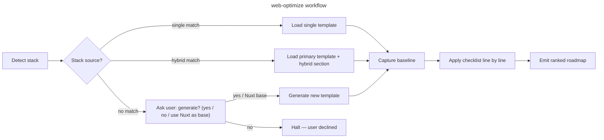

# web-optimize

## Goal

Run a structured performance audit on a web project, picking the right checklist for the detected stack, and emit an actionable roadmap.

## Rules

- Detect the stack BEFORE picking a checklist — never assume Nuxt
- Capture a baseline (PSI / Lighthouse / build output / DB query count) BEFORE recommending changes — without baseline, gains are unfalsifiable
- If no template matches the detected stack, **propose** generating one — never silently fall back to a stack-mismatched checklist
- Recommend changes only after reading at least these 3 files of the actual codebase: (a) the framework config (`nuxt.config.ts` / `vite.config.ts` / `settings.py` / `routes/web.php` / equivalent), (b) the entry point (`app.vue` / `urls.py` / `bootstrap/app.php` / equivalent), (c) one hot route — typically the LCP target. Generic advice without this evidence is rejected
- One row per checklist item, with `🟢 / 🟡 / 🔴 / N/A` + `file:line` references when actionable
- Output goes to `aidd_docs/tasks/audits/<yyyy_mm_dd>_perf-<framework>-<scope-slug>.md`. If `aidd_docs/` does not exist, fallback to `docs/perf-audits/<yyyy_mm_dd>_perf-<framework>-<scope-slug>.md` (create dir if needed). Day-level granularity prevents collision when multiple audits target the same scope in one month
- If a same-day rerun produces a new file for the same scope, append `-v2`, `-v3` to the slug rather than overwriting the previous report
- The DEC step (recording a non-obvious trade-off) is **conditional**: only if `aidd_docs/internal/decisions/` exists; otherwise inline the rationale in the audit report itself
- **Primary deterministic metric** (bytes saved, chunks blocked, SQL queries removed, requests removed) is load-bearing for success. PSI score is a secondary noisy signal — report it but never anchor success solely on it
- PSI variance can dominate any single fix: capture **3-5 baseline runs** before attributing changes (single-run baseline is unfalsifiable). Anonymous Google PSI API rate-limits at ~25/day → for 5+ programmatic runs use https://pagespeed.web.dev/ web UI manually OR a Google API key

## Quick Start

```bash
# 1. Detect the stack — read every relevant manifest
cat package.json 2>/dev/null | grep -E '"(nuxt|vite|vue|astro|svelte|alpinejs)"'
cat composer.json 2>/dev/null | grep -E '"(laravel|symfony|wordpress)/'
ls manage.py 2>/dev/null && echo "Django (settings.py is typically in a subfolder, e.g. <project>/settings.py)"
grep -r "alpinejs" --include="*.html" --include="*.blade.php" --include="*.twig" -l 2>/dev/null | head -5
test -f wp-config.php && echo "WordPress detected"

# 1bis. Detect package manager from lockfile (drives all build commands below)
PM=${PM:-pnpm}
[ -f pnpm-lock.yaml ]    && PM=pnpm
[ -f yarn.lock ]         && PM=yarn
[ -f package-lock.json ] && PM=npm
[ -f bun.lockb ]         && PM=bun
echo "Using package manager: $PM"

# 1ter. Detect monorepo — if any workspace marker is found, STOP and ask user which package to audit
ls pnpm-workspace.yaml turbo.json nx.json lerna.json 2>/dev/null \
  && echo "⚠️  Monorepo detected — STOP and ask the user which package/workspace to audit before continuing"

# 2. Capture baseline (uses $PM detected above)
$PM nuxt build 2>&1 | tee build.log                 # Nuxt — log written to CWD (cross-platform)
$PM vite build --mode production 2>&1 | tee build.log  # Vue SPA
# Django smoke — Bash/WSL syntax shown; on PowerShell: Start-Job { python manage.py runserver }; wrk ...
# wrk install: brew install wrk / apt install wrk / WSL ; fallback: ab -n 100 -c 10 ...
python manage.py runserver & wrk -d 30s http://localhost:8000/
# Then: open https://pagespeed.web.dev/ on the deployed routes

# 3. Apply checklist (see Workflow)
```

> **Cross-project use:** this skill lives in `.claude/skills/web-optimize/` (project-scoped). To use it across all your projects (Django/PHP/etc. elsewhere), copy the `web-optimize/` folder to `~/.claude/skills/web-optimize/`.

## Workflow



### Step 1: Detect stack

**Do:**

1. Read all relevant manifests (a project can mix backend + frontend layer):
   - `package.json` → JS/TS frameworks
   - `composer.json` → PHP (Laravel, Symfony, vanilla)
   - `requirements.txt` / `pyproject.toml` / `manage.py` → Django / Flask / FastAPI
2. Map to one (or more) of:
   `nuxt3`, `vue-spa`, `astro`, `svelte-kit`, `static-html`,
   `django`, `django+alpine`, `django+htmx`,
   `php-laravel`, `php-symfony`, `php-vanilla`, `wordpress`, `php+alpine`,
   `alpine-spa`, `other`
   *(Next.js, Remix, SolidStart, Qwik, Vue 2 / Nuxt 2 fall under `other` until pivots are added to `references/framework-mapping.md`.)*
3. Tell-tale config files:
   - `nuxt.config.ts`, `vite.config.ts`, `astro.config.mjs`
   - `manage.py`, `settings.py` (Django)
   - `artisan`, `routes/web.php` (Laravel) ; `bin/console` (Symfony)
   - `<script src=".../alpinejs">` or `import 'alpinejs'`
4. **Hybrid stack:** if backend (Django/PHP) + frontend layer (Alpine/Vue) coexist, audit BOTH layers — load relevant sections from both `references/framework-mapping.md` entries (do NOT generate a new combined template).

**Success criteria:** Stack(s) + version + role (backend/frontend/full-stack) reported back to user.

### Step 2: Pick or propose checklist

**Do:**

1. Look for matching template under `aidd_docs/templates/dev/perf_checklist_*.md` (or `docs/perf-templates/` if no `aidd_docs/`)
2. **If found** (e.g. `perf_checklist_nuxt.md`): load it and proceed to Step 3
3. **If hybrid stack** (e.g. `django+alpine`): load primary template (`django`) **and** read the matching hybrid section in `references/framework-mapping.md` — for `django+alpine`, the section header is `## Django + Alpine.js (hybride classique)`. For `php+alpine`, refer to `## PHP — Laravel` plus the Alpine pivots from the Django+Alpine section. For WordPress, use `## PHP vanilla / WordPress / autres` plus its plugin-cache notes. Concatenate items in the audit. No new template generated.
4. **If no template matches the stack:** halt the workflow and ask the user before proceeding:

   > "No perf checklist exists for `<stack>`. Should I generate `perf_checklist_<stack>.md` from official best practices adapted to this project? (yes / no / use the Nuxt checklist as a base)"

5. **If user accepts generation:**
   - Use `perf_checklist_nuxt.md` as a structural model: 12 numbered sections (0 Pre-flight → 10 Client-side storage → 11 Verification & non-regression) **plus** a `## Common anti-patterns (rejected)` table **plus** a `## Quick verification commands` block. The last two sections are part of the scaffold but NOT numbered. Section §10 (Client-side storage) is transverse — applies to all JS stacks; see `references/framework-mapping.md` for stack-specific pivots
   - Adapt items via `references/framework-mapping.md`
   - Write to `aidd_docs/templates/dev/perf_checklist_<stack>.md` (or `docs/perf-templates/<stack>.md`)
   - **If `aidd_docs/internal/decisions/` exists:** create a DEC documenting the convention choices
   - **Otherwise:** inline the chosen conventions in the new template's header
   - Continue to Step 3

**Success criteria:** A checklist source is loaded into context, stack-appropriate.

### Step 3: Capture baseline

**Do:**

1. Run framework build, capture warnings (Vite "dynamic import will not move", chunk sizes, errors); for Django/PHP, capture the SQL query count via debug-toolbar / Telescope / Symfony Profiler
2. Capture **3-5 PSI mobile runs** on the target route(s) to establish noise floor:
   - **Preferred:** user runs `https://pagespeed.web.dev/?url=<deployed-route>` 3-5× with 5-min interval (matches Lighthouse cloud baseline)
   - **For 5+ programmatic runs:** Google PSI API key (anonymous tier rate-limits at ~25/day → 429s after a handful of attempts)
   - **Fallback if no deployed URL** (JS stacks): `npx lighthouse <url> --preset=desktop --quiet --output=json --output-path=./lh.json` — but local Lighthouse ≠ PSI cloud (different throttling, different pool, **medians NOT comparable** across the two)
   - **Fallback for pure Python/PHP projects without Node** (Django/Laravel): Docker — `docker run --rm --network=host femtopixel/google-lighthouse <url> --output=json` — or skip Lighthouse and rely on `wrk` + browser DevTools Performance trace for TTFB/CPU
3. Capture a **deterministic baseline** alongside PSI (bundle byte count, chunk list, modulepreload entries, SQL query count) — this is the load-bearing signal
4. Note: LCP / CLS / INP / TBT / TTFB / overall score (min/median/max across runs) / unused JS bytes / SQL queries per request
5. Save baseline as a code block in the audit report header — **characterize PSI variance explicitly** (e.g. "score 53–82 across 3 runs, identical build")

**Success criteria:** Baseline metrics quoted with source AND PSI noise floor characterized AND deterministic baseline (bytes/queries/chunks) recorded.

### Step 4: Apply checklist

**Do:**

1. For each section, run the verification commands listed at the bottom of the matching template (or framework-mapping pivots for hybrid)
2. Mark items with status emoji + actionable note (`file:line` or fix recipe)
3. Quick verification reflexes:

   ```bash
   # JS bundle integrity (Vite/Nuxt)
   pnpm nuxt build 2>&1 | grep -E "(dynamic import will not move|warn|ERROR)"
   pnpm nuxt build 2>&1 | grep -i "modulepreload"

   # Anti-pattern grep across stack (separate --include flags for cross-shell safety)
   grep -rn "transition-all" --include="*.vue" --include="*.css" --include="*.html"
   grep -rn "from ['\"]firebase/" --include="*.vue" --include="*.js" --include="*.ts"
   grep -rn "select_related\|prefetch_related" --include="*.py"  # Django (count usage; missing => N+1 risk)
   grep -rn "->with(" --include="*.php"                          # Laravel Eloquent eager-load

   # Bundle size top-10
   ls -lh .output/public/_nuxt/*.js public/build/assets/*.js dist/assets/*.js 2>/dev/null | sort -k5 -h | tail -10
   ```

4. Group fixes by ROI (quick wins / structural / monitoring)
5. **Null result handling**: an audit step can produce zero actionable findings (e.g. grep for static imports of a heavy lib returns 0 — gisement already exhausted by a previous iteration). Record null results explicitly in the report ("Phase 2 audit: 0 static firebase imports in entry chunk — gisement exhausted by commit 440b248") so the next iteration doesn't redo the same audit

**Success criteria:** Every checklist line has a status; no `[ ]` left unchecked. Null results documented with the reason.

### Step 5: Emit roadmap

**Do:**

1. **Intermediate review gate**: if the audit surfaces > 30 🔴+🟡 items, present a synthesis (top 10 by ROI) to the user and ask for prioritization confirmation BEFORE writing the final report. For shorter audits, skip this gate.
2. Output to `aidd_docs/tasks/audits/<yyyy_mm_dd>_perf-<framework>-<scope-slug>.md` (fallback `docs/perf-audits/...`)
   - `<framework>` example: `nuxt`, `django`, `laravel`
   - `<scope-slug>` example: `marketing-routes`, `dashboard`, `homepage` (the route or area audited)
   - **If `<scope>` not provided as argument:** default to `full-app` (audit covers all routes/areas)
   - **Same-day rerun on the same scope:** suffix with `-v2`, `-v3` to keep history (no overwrite)
3. Phases ordered by ROI (F0 stabilisation → F1 quick wins → F2 structural → F3 monitoring)
4. Each phase: estimated effort + risk + reference (DEC-N or rule path)
5. End with **Quick wins prioritaires** (≤ 4 items doable next week)
6. **Per-fix success criterion**: define primary (deterministic delta) + secondary (PSI median). Declare "real gain" only if PSI **median post-fix > maximum pre-fix**, else: "fix shipped, PSI variance dominates, deterministic delta is the trustable signal" (DEC-030, iteration 5 pattern)
7. **Bugs found during audit → issue, not normative patch**: a single-occurrence bug (e.g. `setInterval` handle not stored, off-by-one in pagination, missing `await`) belongs in:
   - The audit report's roadmap (F1/F2 with file:line + fix recipe), AND
   - A new tracker issue created via `gh issue create` (or equivalent) so the fix has a follow-up owner
   - **Never** in the checklist's anti-patterns table, the framework-mapping pivots, or `.claude/rules/` — those files codify recurring patterns, not point fixes. A bug ≠ an anti-pattern.
   - Threshold for normative elevation: see Step 6 (≥ 2 distinct occurrences OR a known generic class — OWASP, Web.dev, MDN)

**Success criteria:** User can execute Phase F0 from the report alone, no further questions. Each fix has a deterministic primary success criterion. Each bug has either a roadmap entry + tracker issue, or is silently fixed in the same PR if trivial — never normative pollution.

### Step 6: Self-audit & skill feedback

**Do:**

1. After the audit report is written, walk §12 of the checklist (Checklist self-audit) — this is mandatory, not optional
2. Append a `## Checklist learnings` section at the top of the audit report capturing:
   - Gaps (issues found outside the checklist) — formatted `[gap] §N: <missing bullet>`
   - False positives (items N/A on this stack) — formatted `[fp] §N: <bullet> — reason`
   - Ambiguous items reformulated — formatted `[reword] §N: <before> → <after>`
   - Anti-patterns surfaced ≥ 2× — formatted `[antipattern] <pattern> | <why rejected>`
   - Useful ad-hoc commands — formatted `[grep] <command> — <what it surfaces>`
   - Missing pivots in `framework-mapping.md` — formatted `[pivot] <stack>: <missing pivot>`
   - **Bugs found ≠ anti-patterns**: a single-occurrence bug goes to the roadmap + tracker issue (see Step 5.7), NOT into `[antipattern]`. Only elevate to anti-pattern if you can cite ≥ 2 distinct occurrences in the codebase OR a recognized generic class (OWASP, MDN, Web.dev).
3. **Trigger threshold**: if learnings count ≥ 3 gaps OR ≥ 1 anti-pattern OR ≥ 1 missing pivot → propose patches to the user explicitly (do NOT silently edit):
   - Diff for `aidd_docs/templates/dev/perf_checklist_<stack>.md`
   - Diff for `references/framework-mapping.md`
   - Diff for `tests.md` if a new detection case emerged
4. On user accept → apply patches; on reject → archive the learnings in the audit report only (next iteration will re-surface them)
5. Below the trigger threshold → keep `## Checklist learnings` in the report; future audits aggregate

**Success criteria:** Every audit ends with a `## Checklist learnings` section, even if empty (`[none]` line). The skill gets monotonically better project-by-project.

## Resources

| Type      | Path                                                | Description                                                                            |
| --------- | --------------------------------------------------- | -------------------------------------------------------------------------------------- |
| Template  | `aidd_docs/templates/dev/perf_checklist_nuxt.md`    | Reference checklist (Nuxt 3); model for new stack templates                            |
| Template  | `aidd_docs/templates/dev/perf_checklist_<stack>.md` | Auto-generated on first audit when missing (e.g. `vue-spa`, `django`, `laravel`)       |
| Reference | `references/framework-mapping.md`                   | Pivots LCP/CLS/INP/TTFB/N+1 per stack (Nuxt, Vue SPA, Django, Alpine, PHP, static)     |
| Output    | `aidd_docs/tasks/audits/<yyyy_mm_dd>_perf-<framework>-<scope-slug>.md` | Audit report destination (fallback `docs/perf-audits/...` if no `aidd_docs/`) |
| Tests     | `.claude/skills/web-optimize/tests.md`              | Smoke test cases for stack detection — run before trusting the skill on new stacks     |
