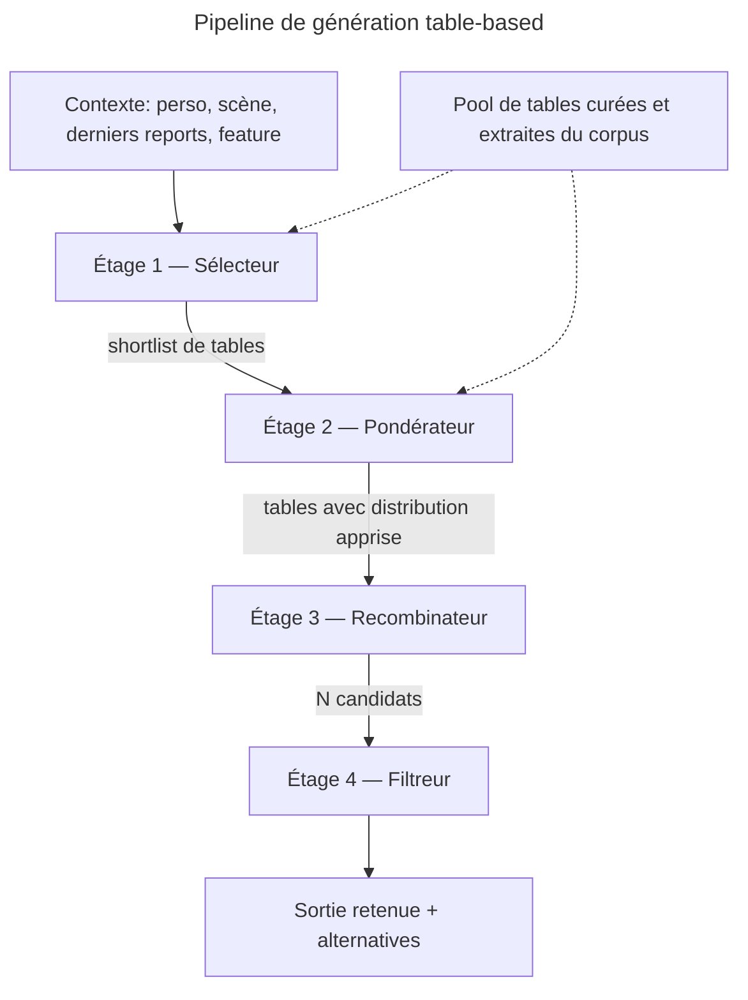
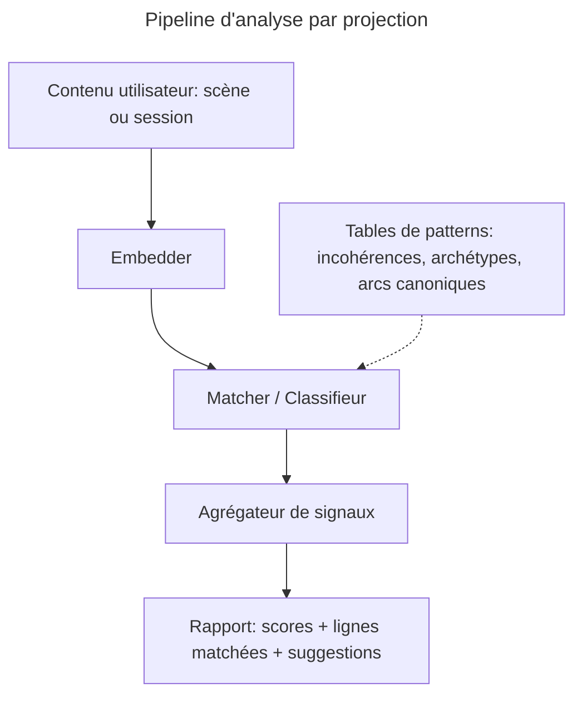

# Architecture — Tables aléatoires + ML

## Contexte du pivot

L'approche initiale (LLM fine-tuné + LoRA stacking sur 3 axes — univers, situation, voix) est abandonnée.

**Causes** :

- Volume de corpus insuffisant pour atteindre une qualité acceptable par fine-tune (seuil 500 sessions/genre jamais atteint).
- Dépendance GPU/inférence non tenable économiquement.

**Nouvelle mécanique** : un algorithme de choix tire dans des tables curées (au sens JdR), et un pipeline ML rend ces tirages contextuels au lieu d'uniformes. Le périmètre fonctionnel défini dans `external/use-cases.md` reste intact (features #77–#89) ; seul le moyen change.

## Principes directeurs

1. **Aucune génération de tokens** — toute sortie est composée à partir de lignes de tables existantes.
2. **Tirage non-uniforme** — chaque tirage est pondéré par le contexte via un modèle ML léger.
3. **Explicabilité** — chaque sortie est traçable jusqu'aux lignes tirées et aux scores des étages.
4. **CPU-only** — classifieurs, embeddings, rerankers de petite taille (distillation, sentence-transformers).
5. **Asymétrie génération / analyse** — génération = tirage *depuis* une table ; analyse = projection *sur* une table de patterns.

## Les 4 niveaux de granularité de tables

| Niveau                  | Contenu                                  | Exemples                                                 | Usage                                                |
| ----------------------- | ---------------------------------------- | -------------------------------------------------------- | ---------------------------------------------------- |
| **Entités atomiques**   | unités lexicales typées                  | gestes, émotions, lieux, objets, noms, traits            | remplissage de slots, briques pour niveaux supérieurs |
| **Templates à trous**   | squelettes paramétrés                    | « {char} {geste} en {émotion}, {action_suite} »          | structure de phrase ; slots typés tirent dans les entités |
| **Beats narratifs**     | unités de niveau scène                   | « hésitation », « rupture de ton », « révélation »        | décident QUOI dire avant de décider COMMENT          |
| **Fragments narratifs** | sorties complètes prêtes à l'emploi      | répliques / phrases curées depuis corpus                 | échantillonnés directement si beat + contexte alignés |

Une **table** = ensemble de lignes typées au même niveau, partageant un slot d'usage (ex: « gestes de combat médiéval », « beats de romance »).

Chaque table porte des **tags** sur les 3 axes existants (univers, situation, voix). Le sélecteur (étage 1) filtre par tags avant tirage — pas d'explosion combinatoire de jeux de tables.

## Pipeline de génération — 4 étages

### Étage 1 — Sélecteur

- **Rôle** : choisir le sous-ensemble de tables pertinentes pour la feature et le contexte.
- **Entrée** : embedding du contexte + tags axiaux + feature demandée.
- **Modèle** : classifieur multi-label léger (logistic regression ou petit MLP sur embeddings).
- **Sortie** : shortlist de N tables avec score de pertinence (typiquement N = 3 à 8).

### Étage 2 — Pondérateur

- **Rôle** : pour chaque table shortlistée, transformer la distribution uniforme en distribution apprise (les lignes les plus pertinentes au contexte ont une probabilité plus haute).
- **Modèle** : reranker cross-encoder léger OU similarité d'embeddings contexte ↔ ligne, normalisée en softmax.
- **Sortie** : pour chaque table, vecteur de probabilités sur ses lignes.

### Étage 3 — Recombinateur

- **Rôle** : tirer K échantillons par étage de granularité (beat → template → slots remplis depuis entités) et les assembler en N candidats de sortie textuelle.
- **Modèle** : règles d'assemblage déterministes pour les cas simples, petit modèle séquentiel optionnel pour le sequencing complexe.
- **Sortie** : N candidats (typiquement N = 5 à 10).

### Étage 4 — Filtreur

- **Rôle** : scoring best-of-N. Évaluer cohérence de chaque candidat avec contexte, style, voix.
- **Modèle** : cross-encoder (contexte ↔ candidat) entraîné sur l'historique accept/reject utilisateur.
- **Sortie** : 1 candidat retenu, top-2 et top-3 gardés pour variations / fallback UI.

## Mapping feature → niveaux exploités

| Feature                              | Niveaux dominants                            | Étages actifs                                                 |
| ------------------------------------ | -------------------------------------------- | ------------------------------------------------------------- |
| Suggestion dialogue (#77)            | fragments + entités                          | tous (emphase fragments)                                      |
| Suggestion action (#78)              | beats + templates + entités                  | tous (recombinateur central)                                  |
| Suggestion description (#79)         | templates + entités (lieux/ambiances)        | tous                                                          |
| Suggestion pensée intérieure (#80)   | beats + templates + entités                  | tous                                                          |
| Export prompt vidéo (#89)            | templates visuels + entités                  | sélecteur + pondérateur + recombinateur (canevas fixe, pas de filtre best-of-N) |

## Pipeline d'analyse — projection inversée

Pour les features d'analyse, les tables deviennent des **catalogues de patterns**. Le contenu utilisateur est projeté dessus pour produire un rapport, au lieu de tirer pour produire du texte.

| Feature                          | Tables de patterns                                      | Mécanisme                                                  |
| -------------------------------- | ------------------------------------------------------- | ---------------------------------------------------------- |
| Cohérence scène (#81)            | types d'incohérence (caractère/ton), beats canoniques   | classification multi-label par fragment de scène           |
| Cohérence session (#82)          | arcs narratifs canoniques, archétypes personnage        | matching séquentiel de beats + scoring d'arc               |
| Résumé de session (#83)          | templates de résumé tagués genre/situation              | extraction de beats par projection + remplissage du template |
| Suggestions liens fédérés (#84)  | embeddings des personnages publics de l'instance        | similarité d'embeddings + seuil                            |

## Provenance des tables

Trois voies d'alimentation à combiner :

1. **Mining corpus → clustering → tables candidates**
   - S'appuie sur `pipelines/anonymization/` et `pipelines/crawl_rpv/` (déjà présents).
   - Extraction NER, segmentation en beats, dédup + clustering sémantique des fragments.
   - Génère des tables candidates à fort volume mais bruitées.
2. **Curation manuelle**
   - Validation / nettoyage / ajout d'entrées.
   - Versionnée en git, format JSONL ou YAML diff-friendly.
3. **Boucle de rétroaction utilisateur**
   - Accept → renforce la combinaison (ligne tirée, contexte d'appel).
   - Reject ou édition → signal négatif ; édition capturée comme candidat fragment.
   - Alimente le ré-entraînement des étages 1, 2, 4.

## Format de stockage (proposition)

- 1 fichier JSONL par table, versionné en git.
- Index SQLite avec FTS5 et colonnes de tags pour query rapide.
- Embeddings pré-calculés des lignes en `.npy` à côté de chaque JSONL.
- Pas de DB serveur pour le MVP — tout sur disque, déployable en read-only.

## Hors périmètre de ce document

- Choix précis des modèles ML (à figer en POC).
- Schéma détaillé des tables (champ par champ).
- Pipeline de fabrication des tables depuis le corpus existant.
- Refonte de la grille tarifaire Muses (l'inférence quasi gratuite invalide la grille actuelle de `use-cases.md` §1.2).
- Réécriture de la doc périmée (`README.md`, `architecture.md`, `project_brief.md`, `codebase_map.md`).

Chacun de ces points fera l'objet d'un document dédié.

## Questions ouvertes à acter

1. **Tagging vs jeux de tables séparés** — confirmer le choix de tags axiaux (univers/situation/voix) plutôt que des jeux distincts par combinaison.
2. **Période transition** — les anciens documents (`README.md`, `architecture.md`, etc.) restent-ils actifs en lecture publique pendant la transition, ou sont-ils marqués obsolètes immédiatement ?
3. **Cible MVP** — bien que le périmètre vise toutes les features, sur laquelle valider le pipeline end-to-end en premier ? (proposition par défaut : `suggestion de dialogue` #77, niveau fragments + entités, le plus simple.)
4. **Seuil d'activation du filtre** — un best-of-N nécessite N candidats minimum ; pour les features où la base de tables est encore petite, fallback à top-1 du recombinateur ?
