# Plan technique

> Roadmap actionnable pour passer de la théorie (les sept documents cités dans `architecture.md`) au service Muses fonctionnel. Format : graphe de dépendances + tableau plat des tâches.

## Chemin critique

```mermaid
---
title: Chemin critique des dépendances
---
flowchart LR
    Cleanup["Cleanup code obsolete"]
    Schema["Schema axes et rows"]
    TableIO["I/O tables JSONL+SQLite+npy"]
    Ingest["Ingestion + validation"]
    Anonym["Adapter pipelines anonymisation"]
    Mining["Pipeline mining bootstrap"]
    Tables0["Premières tables peuplées"]
    Stage1H["Étage 1 heuristique"]
    Stage2C["Étage 2 cosinus"]
    Stage3R["Étage 3 règles"]
    Stage4N["Étage 4 no-op"]
    PipeMVP["Pipeline MVP assemblé"]
    ApiMVP["API suggest dialogue"]
    AuthAP["Auth ActivityPub"]
    Deploy0["Déploiement v0"]
    Client["MusesClient instance"]
    Signals["5 signaux UI"]
    Trust["Trust beta reputation"]
    Online["Online learning étages 1/2/4"]
    Profile["Profil de style"]
    StagesV2["Étages v2 - ML appris"]
    Analyse["Pipeline analyse"]
    Features["Autres features"]

    Cleanup --> Schema
    Schema --> TableIO
    TableIO --> Ingest
    Ingest --> Anonym
    Anonym --> Mining
    Mining --> Tables0
    Tables0 --> Stage2C
    Schema --> Stage1H
    Schema --> Stage3R
    Schema --> Stage4N
    Stage1H --> PipeMVP
    Stage2C --> PipeMVP
    Stage3R --> PipeMVP
    Stage4N --> PipeMVP
    PipeMVP --> ApiMVP
    ApiMVP --> AuthAP
    AuthAP --> Deploy0
    Deploy0 --> Client
    Client --> Signals
    Signals --> Trust
    Signals --> Online
    Online --> StagesV2
    Trust --> StagesV2
    Signals --> Profile
    Tables0 --> Analyse
    StagesV2 --> Features
```

Le chemin critique (le plus long) passe par : Cleanup → Schema → TableIO → Ingest → Anonym → Mining → Tables0 → Stage2C → PipeMVP → ApiMVP → AuthAP → Deploy0 → Client → Signals → (Trust + Online) → StagesV2.

Toute tâche hors de ce chemin peut être parallélisée si la dépendance immédiate est satisfaite.

## Milestones

| Milestone | Objet | Sortie observable |
|-----------|-------|-------------------|
| **M0** | Fondations | code obsolète purgé, schéma rows opérationnel, I/O tables fonctionnelle |
| **M1** | Bootstrap corpus | premières tables peuplées depuis sources publiques, anonymisation et mining adaptés |
| **M2** | MVP une feature | API `suggest_dialogue` end-to-end depuis une instance Suddenly mockée, pipeline 4 étages dans leurs versions minimales |
| **M3** | Boucle de feedback | 5 signaux UI captés, trust contextuel calculé, online learning sur étages 1/2/4, profil de style |
| **M4** | Production | déploiement public, auth ActivityPub réelle, monitoring, mode dégradé côté instance |
| **M5** | Extension | autres features de génération (action, description, pensée), pipeline d'analyse, features hybrides (résumé, liens, prompt vidéo) |

## Tableau plat des tâches

| ID  | Tâche | Milestone | Dépend de | Statut |
|-----|-------|-----------|-----------|--------|
| T01 | Supprimer les tests obsolètes (`test_gateway`, `test_auth`, `test_evaluate*`, `test_*provider*`, `test_train_*`, `test_suddenly_ai_hub`) | M0 | — | TODO |
| T02 | Nettoyer `tests/` des imports vers modules supprimés | M0 | T01 | TODO |
| T03 | Refondre `pyproject.toml` (drop extras `gateway`, dépendances LoRA-era) | M0 | T01 | TODO |
| T04 | Renommer `PROJECT_INFO.json` champs LoRA et phases obsolètes ou supprimer | M0 | — | TODO |
| T05 | Implémenter validateur de schéma row Pydantic (cf. `data-format.md`) | M0 | — | TODO |
| T06 | Implémenter validateur de tags (set canonique de `axes-and-tags.md`) | M0 | T05 | TODO |
| T07 | I/O tables : lecture / écriture JSONL append-only | M0 | T05 | TODO |
| T08 | Construction index SQLite FTS5 depuis JSONL | M0 | T07 | TODO |
| T09 | Calcul + persistance embeddings `.npy` par table | M0 | T07 | TODO |
| T10 | Pipeline d'ingestion (signature + anonymisation + validation + insertion) | M0 | T07, T08, T09 | TODO |
| T11 | Adapter `pipelines/anonymization/` pour produire des `content` exploitables (placeholders typés) | M1 | T10 | TODO |
| T12 | Adapter `pipelines/crawl_rpv/` pour pipeline d'ingestion vers tables | M1 | T11 | TODO |
| T13 | Extracteur d'entités (NER + clustering de variantes) | M1 | T11 | TODO |
| T14 | Segmentation en beats (classifieur léger ou rules) | M1 | T11 | TODO |
| T15 | Bootstrap initial : peupler 1 cellule prioritaire `(univers, situation, voix, ...)` avec ~100 rows par niveau | M1 | T12, T13, T14 | TODO |
| T16 | Étage 1 sélecteur : v0 par tag matching strict + fallback hiérarchique | M2 | T07 | TODO |
| T17 | Étage 2 pondérateur : v0 par similarité cosinus sur embeddings pré-calculés | M2 | T09 | TODO |
| T18 | Étage 3 recombinateur : règles d'assemblage + remplissage de slots typés | M2 | T07 | TODO |
| T19 | Étage 4 filtreur : v0 no-op (passthrough top-N) | M2 | T17 | TODO |
| T20 | Orchestrateur pipeline (chaînage des 4 étages) | M2 | T16, T17, T18, T19 | TODO |
| T21 | API HTTP : endpoint `POST /v1/suggest/dialogue` (cf. `use-cases.md` §2.1) | M2 | T20 | TODO |
| T22 | Auth signature HTTP ActivityPub côté serveur (stub vérifiable en local) | M2 | T21 | TODO |
| T23 | Déploiement v0 sur une instance unique (Hetzner ou équivalent CPU-only) | M2 | T22 | TODO |
| T24 | `MusesClient` Python pour l'instance Suddenly (suggest seulement) | M2 | T23 | TODO |
| T25 | Smoke test end-to-end (instance mockée → service Muses → réponse) | M2 | T24 | TODO |
| T26 | Capture des 5 signaux UI côté service (event log) | M3 | T25 | TODO |
| T27 | Trust contextuel : Beta reputation par `(user, axe, valeur)` + persistence | M3 | T26 | TODO |
| T28 | Réputation d'instance + multiplicateur global | M3 | T26 | TODO |
| T29 | Online learning étage 4 : pairwise preference (DPO-lite) | M3 | T26 | TODO |
| T30 | Online learning étage 1 : SGD multi-label sur tables/contexte | M3 | T26 | TODO |
| T31 | Online learning étage 2 : pairwise hinge sur embeddings | M3 | T26 | TODO |
| T32 | Profil de style auteur : histogrammes 4 niveaux + décroissance temporelle | M3 | T26 | TODO |
| T33 | Mode challenge : malus profil dans étage 2 + MMR dans étage 4 | M3 | T32, T29 | TODO |
| T34 | Anti-sleeper / anti-takeover / quality gating implémentés | M3 | T27, T28 | TODO |
| T35 | Endpoint `/v1/admin/coverage` (carte de couverture pour admin Muses) | M3 | T07 | TODO |
| T36 | Méta-suggestions batch nocturne | M3 | T32 | TODO |
| T37 | Déploiement public + monitoring (Prometheus / logs structurés) | M4 | T34 | TODO |
| T38 | Mode dégradé côté MusesClient (UI grisée si service down) | M4 | T24 | TODO |
| T39 | Spec opérationnelle de l'API → `infrastructure.md` | M4 | T37 | TODO |
| T40 | Snapshots + rollback des poids ML | M4 | T29, T30, T31 | TODO |
| T41 | Feature `suggest_action` (#78) | M5 | T20 | TODO |
| T42 | Feature `suggest_description` (#79) | M5 | T20 | TODO |
| T43 | Feature `suggest_thought` (#80) | M5 | T20 | TODO |
| T44 | Feature `video_prompt` (#89) — pipeline sans étage 4 | M5 | T20 | TODO |
| T45 | Pipeline d'analyse : embedder + matcher + agrégateur | M5 | T09 | TODO |
| T46 | Tables de patterns pour cohérence scène (#81) | M5 | T45 | TODO |
| T47 | Feature `analyze_consistency_scene` (#81) | M5 | T45, T46 | TODO |
| T48 | Feature `analyze_consistency_session` (#82) | M5 | T45 | TODO |
| T49 | Feature `summary` (#83) — pipeline hybride | M5 | T45, T20 | TODO |
| T50 | Feature `federated_links` (#84) — embedding similarity | M5 | T09 | TODO |
| T51 | Étages v2 ML appris (étage 1 classifieur, étage 2 cross-encoder, étage 4 cross-encoder) | M5 | T30, T31, T29 | TODO |

## Choix MVP

La cible MVP par défaut (cf. `architecture-tables-ml.md` § Questions ouvertes) est `suggestion de dialogue` (#77) parce que :

- Le niveau `fragment` domine — tirages les plus simples à mettre en œuvre.
- Pas de recombinaison complexe nécessaire dans l'étage 3 pour le MVP (fragments servis tels quels).
- Permet de mesurer la qualité dès qu'on a quelques centaines de rows dans une cellule contextuelle.

La cellule contextuelle initiale prioritaire est celle pour laquelle on a le plus de corpus exploitable (probablement `univers=medieval_fantastique` + `situation=combat`, à confirmer après inventaire du corpus disponible).

## Hors périmètre de ce plan

- **Choix d'hébergement précis** (Hetzner vs OVH vs autre) — décision opérationnelle au moment de M2 / M4.
- **Choix des modèles d'embedding et de cross-encoder** — à figer en POC selon contraintes CPU.
- **Refonte tarifaire** (unité d'usage) — orthogonale au plan technique, à mener en parallèle.
- **Côté instance Suddenly** — l'implémentation UI, la migration de la grille Muses, l'opt-in flow détaillé ne sont **pas** dans ce repo. Ils relèvent du repo `suddenly` côté instance.
