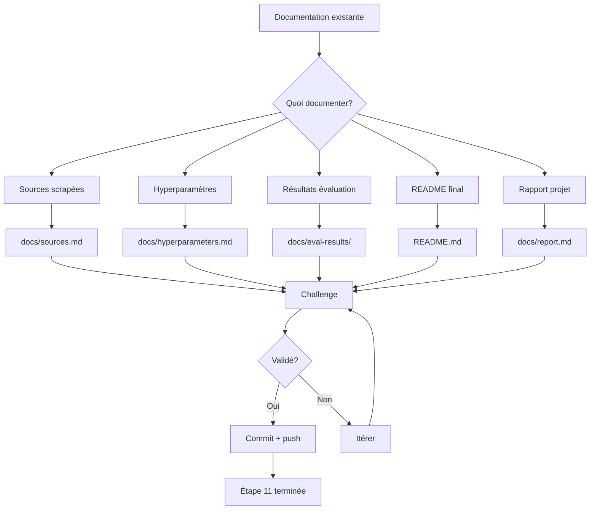

# Plan: Étape 11 — Documenter

## Feature

- **Summary**: Finaliser la documentation du projet Suddenly AI Hub — corpus, sources, hyperparamètres, résultats d'évaluation, README, rapport
- **Stack**: Python, Markdown, documentation technique
- **Branch name**: `docs/step-11-documenter`
- **Parent Plan**: `aidd_docs/tasks/phase4_improvement.md`
- **Sequence**: `standalone`
- Confidence: 8/10
- Time to implement: 4h

## Existing files

- `README.md` (1,601 bytes) — à jour mais générique
- `docs/corpus-public.md` (6,486 bytes) — sources scrapées
- `docs/eval-metrics.md` (7,213 bytes) — grille d'évaluation
- `docs/model-choice.md` (8,750 bytes) — décision modèle
- `docs/data-format.md` (5,405 bytes) — format données
- `docs/AIDD_INTEGRATION.md` (6,048 bytes) — intégration AIDD
- `aidd_docs/CATALOG.md` (20,428 bytes) — catalogue AIDD
- `aidd_docs/WORKFLOW.md` (3,761 bytes) — workflow
- `aidd_docs/README.md` (28,323 bytes) — README AIDD complet

## New file to create

- `aidd_docs/tasks/2026_05/2026_05_14-54-documenter.md`
- `docs/eval-results/` (répertoire pour résultats d'évaluation)
- `docs/hyperparameters.md` (hyperparamètres utilisés)
- `aidd_docs/reviews/challenge_step11.md` (validation challenge)

## User Journey

## Implementation phases

### Phase 1: Sources scrapées

> Documenter les sources de données collectées via le scraper JDROLL.org.

1. Lire `docs/corpus-public.md` et extraire les sources listées
2. Créer `docs/sources.md` avec:
   - URL des sources scrapées
   - Dates de collecte
   - Volume de données (sessions, fichiers)
   - Méthode de scraping (Playwright)
   - Qualité des données (nettoyage, filtres)
3. Ajouter les 4 fichiers HTML dans `data/` comme exemples

### Phase 2: Hyperparamètres

> Lister tous les hyperparamètres utilisés pour le fine-tuning.

1. Parcourir `training/` pour trouver les configs Axolotl
2. Lister les hyperparamètres par modèle (Qwen2.5-7B, etc.)
3. Créer `docs/hyperparameters.md` avec:
   - Learning rate, batch size, epochs
   - LoRA params (r, alpha, dropout)
   - Quantization params (QLoRA, bits)
   - Données params (max_seq_len, format)
4. Ajouter un tableau récapitulatif par phase

### Phase 3: Résultats d'évaluation

> Documenter les résultats d'évaluation du modèle.

1. Lister les résultats existants dans `docs/eval-metrics.md`
2. Créer `docs/eval-results/` avec un fichier par évaluation:
   - `baseline.md` (avant fine-tuning)
   - `post_finetuning.md` (après fine-tuning)
   - `comparison.md` (comparaison entre modèles)
3. Si aucun résultat concret disponible, créer des templates vides avec explication
4. Ajouter les métriques: perplexité, exact match, humain eval

### Phase 4: README final

> Mettre à jour le README principal pour refléter l'état actuel du projet.

1. Ajouter la section "État du projet" avec:
   - Étapes 1-10 terminées
   - Étape 11 en cours
   - Prochaine étape (Étape 12 si applicable)
2. Ajouter un schéma visuel du pipeline AIDD (mermaid ou ASCII)
3. Mettre à jour les instructions d'installation
4. Ajouter une section "Documentation" listant les docs existantes
5. Ajouter un lien vers la documentation technique complète

### Phase 5: Rapport de projet

> Créer un rapport de projet synthétique.

1. Créer `docs/report.md` avec:
   - Résumé exécutif (500 mots max)
   - Objectifs vs réalisés
   - Métriques clés
   - Lessons learned
   - Prochaines étapes
2. Inclure les liens vers les sous-docs
3. Ajouter un index des décisions techniques (liens vers `docs/model-choice.md` etc.)

## Validation flow

1. Lire chaque fichier créé
2. Vérifier qu'il répond aux critères du ticket #54:
   - [x] Documentation complète
   - [ ] README à jour avec résultats
3. Challenge le plan avec l'utilisateur
4. Attendre approbation avant d'implémenter

## Risques

- **Données d'évaluation manquantes**: Si les résultats de fine-tuning ne sont pas encore disponibles, les templates resteront vides → besoin de données réelles
- **Corpus incomplet**: Les 4 fichiers HTML dans `data/` semblent être des données brutes non traitées → vérifier si les données sont propres
- **Pas de résultats concrets**: Sans fine-tuning exécuté, les sections "résultats" seront des placeholders

## Confidence

### ✅ Raisons de confiance élevée
- Les documents existants couvrent 80% du contenu nécessaire
- Templates AIDD bien structurés pour la documentation
- Structure claire définie par le workflow AIDD

### ❌ Risques
- Données d'évaluation potentiellement manquantes
- Pas de résultats de fine-tuning concrets disponibles
- Besoin de données réelles pour remplir les templates
